# Desafío - Django, PostgreSQL básico

Este proyecto consiste en la creación de un proyecto Django llamado "desafiodb" y una aplicación llamada "testdb", que se conectará a una base de datos PostgreSQL localmente llamada "adl-test". Además, se debe generar y aplicar migraciones para crear una tabla llamada "adltest" con los campos "campo1" (char de largo 100) y "valor1" (integer).

## Requerimientos

1. **Creación de carpeta de Proyecto y su entorno virtual:**
    - Generación del entorno virtual
    - Instalación de Django 4.2.11
    - Actualización de pip
    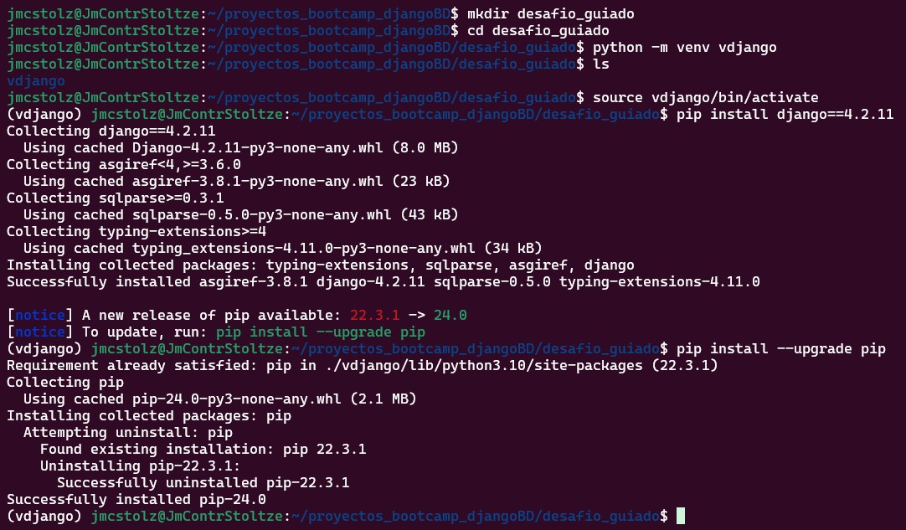.

2. **Inicio del proyecto y aplicación (startproject - startapp):**
    - Se genera proyecto "desafiodb"
    - Se genera aplicación "testdb"
    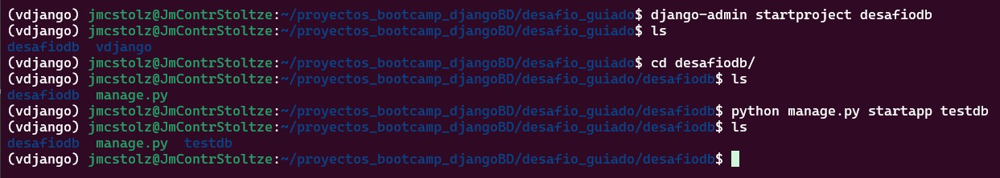.

3. **Aplicaciones instaladas:**
    - En el archivo `settings.py` se agrega "testdb"
    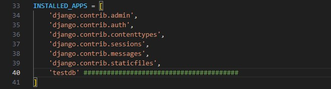.

4. **Creación del modelo:**
    - En `models.py` se genera la clase del modelo "adltest"
    - Debe tener un "campo1" y un "valor1"
    - Se adiciona un ID como clave primaria autogenerada
    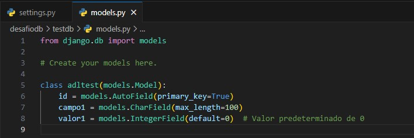.

5. **Instalación de psycopg2:**
    - Se instala en el entorno local
    - Generación del archivo "requirements.txt"
    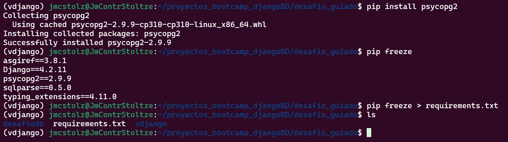.

6. **Base de datos y migraciones:**
    - Se agrega la base de datos en el archivo `settings.py` del proyecto
    - Se debe incluir el usuario y password de postgresql
    - La base de datos debe ser creada en postgresql antes de realizar las migraciones
    - Se ejecutan las migraciones (python manage.py makemigrations - python manage.py migrate)
    - La lista de relaciones se puede visualizar tanto en la terminal de postgresql, como en Dbeaver
    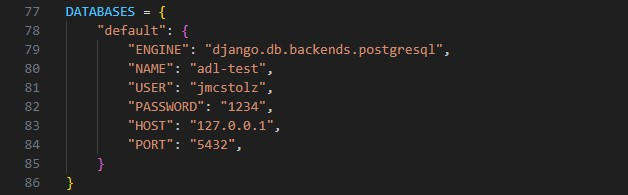.
    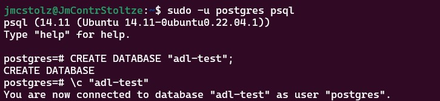.
    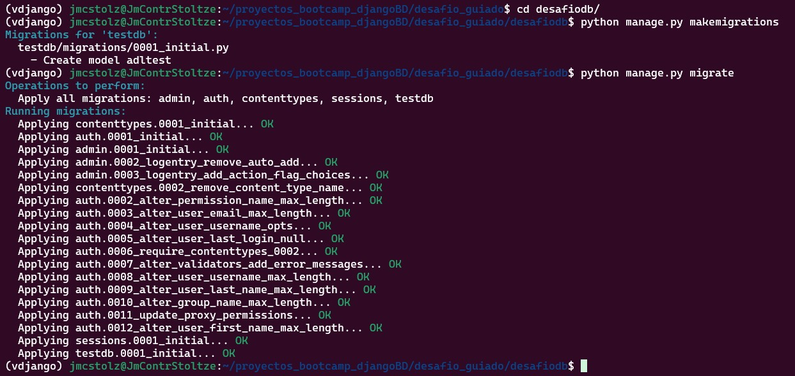.
    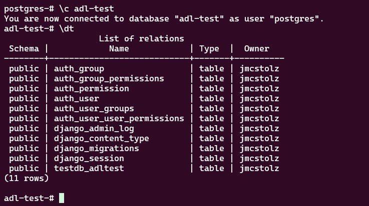.
    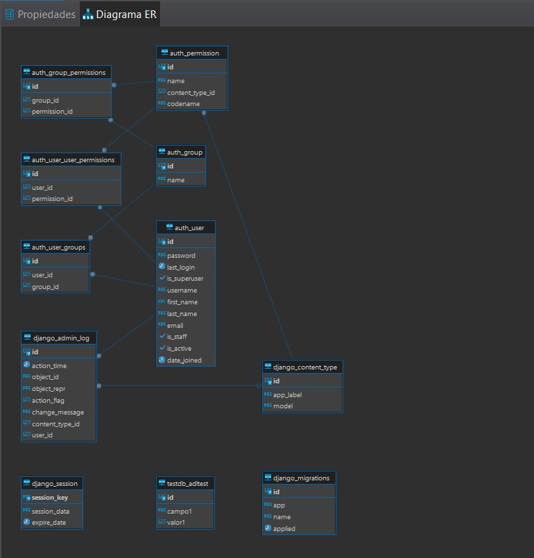.
    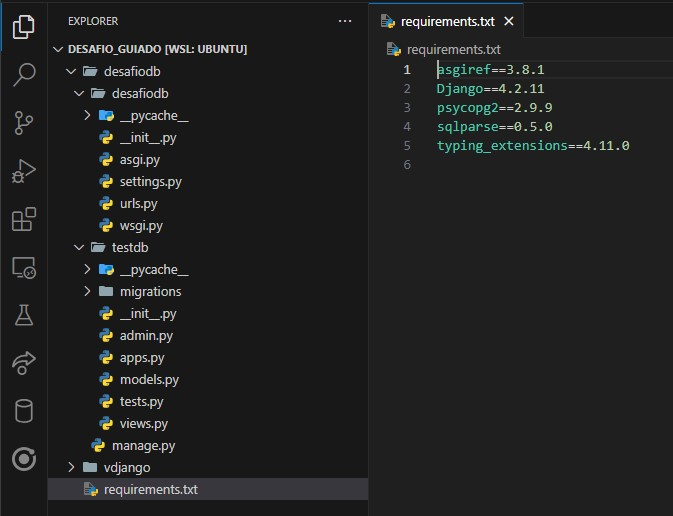.

## Autor

    Jose Contreras Stoltze para Desafio-Latam-2024
    ¡Gracias!

    ---
